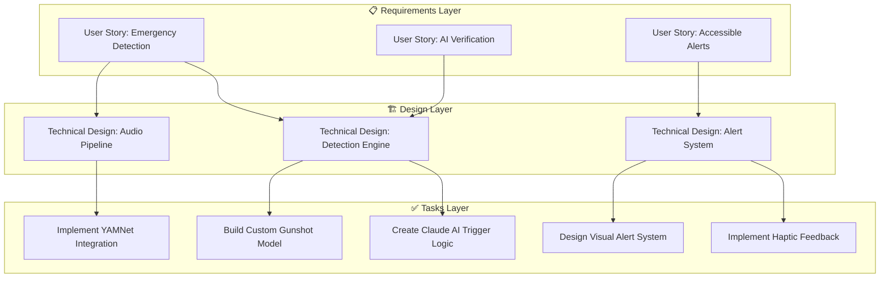

  

<h1 align="center">HERO Documentation</h1>

  <strong>Spec-Driven Development with Kiro IDE</strong> 
  Where vision becomes architecture, and architecture becomes reality

  <a href="#vision">Vision</a> •
  <a href="#specs">Specs</a> •
  <a href="#architecture">Architecture</a> •
  <a href="#hooks">Hooks</a> •
  <a href="#mcp">MCP</a>

---

## 🎯 Vision

**Silent Sentinel** emerged from a single, haunting question:

> *What happens when you can't hear the danger that could kill you?*

23 million Americans live in silence. For them, every fire alarm, every breaking window, every gunshot exists only as vibrations they may never feel in time.

**This project exists to change that.**

---

## 📐 Spec-Driven Approach

Kiro's spec-driven development transformed our approach from chaotic hacking to structured engineering.

### The Three-Layer Spec System

---

## 🧠 Core Specifications

### User Stories Generated by Kiro

| ID | Story | Priority | Status |
|----|-------|----------|--------|
| US-001 | As a deaf user, I need visual alerts for emergency sounds | P0 | ✅ Complete |
| US-002 | As a user, I want AI verification to reduce false alarms | P0 | ✅ Complete |
| US-003 | As a user, I need haptic feedback for critical alerts | P1 | ✅ Complete |
| US-004 | As a power user, I want keyboard shortcuts | P2 | ✅ Complete |
| US-005 | As a user, I want theme customization | P3 | ✅ Complete |

### Technical Design Documents

- [detection.md](../specs/detection.md) — Audio detection pipeline architecture
- [ui-ux.md](../specs/ui-ux.md) — User interface specifications
- [architecture.md](./architecture.md) — System architecture overview

---

## 🔗 Navigation

| Document | Description |
|----------|-------------|
| [📐 Architecture](./architecture.md) | System design and data flow |
| [📋 Planning](./planning.md) | Development roadmap and milestones |
| [🪝 Hooks](../hooks/README.md) | Automated workflow triggers |
| [🔌 MCP](../mcp/README.md) | Model Context Protocol integrations |
| [🎯 Steering](../steering/product.md) | Project guidance files |

---

  Built with Kiro IDE • HackXios 2025

