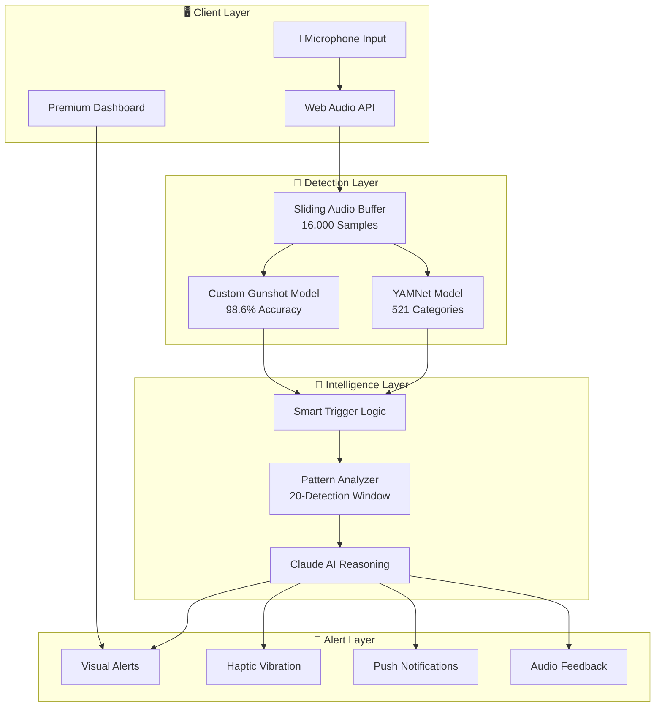
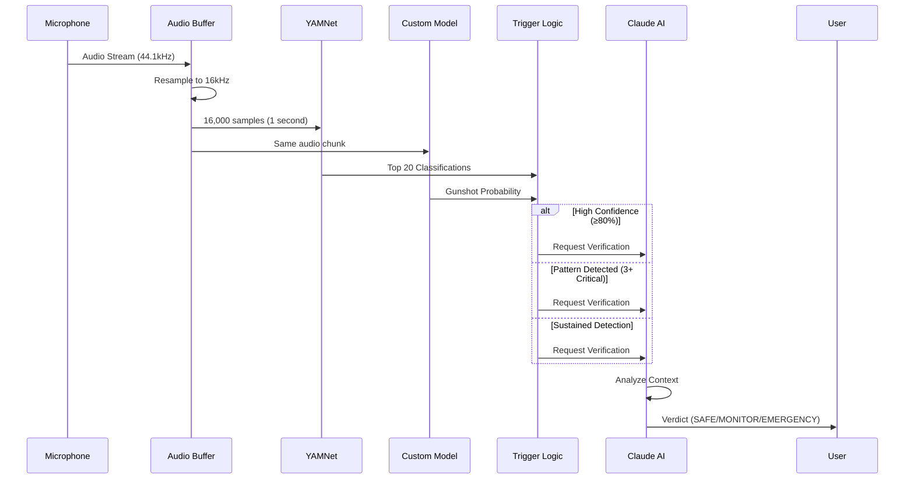
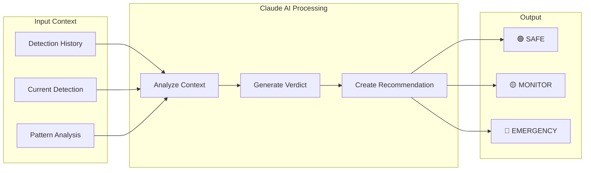

# 🏗️ System Architecture

> Technical design generated through Kiro's spec-driven development

---

## High-Level Architecture



---

## Detection Pipeline

### Audio Processing Flow



---

## Component Specifications

### Detection Module

| Component | Technology | Purpose |
|-----------|------------|---------|
| Audio Capture | Web Audio API | Real-time microphone access |
| Sample Buffer | Circular Buffer | Efficient 1-second audio window |
| Resampling | Linear Interpolation | 44.1kHz → 16kHz conversion |
| Primary Model | YAMNet (TensorFlow.js) | 521-category classification |
| Secondary Model | Custom CNN | Binary gunshot detection |

### Trigger Logic

```
┌─────────────────────────────────────────────────────────────┐
│                    CLAUDE TRIGGER CONDITIONS                │
├─────────────────────────────────────────────────────────────┤
│                                                             │
│  Condition 1: High Confidence                               │
│  └─→ Any critical sound ≥ 80% confidence                   │
│                                                             │
│  Condition 2: Pattern Detection                             │
│  └─→ 3+ critical sounds in 20-detection window             │
│                                                             │
│  Condition 3: Sustained Detection                           │
│  └─→ Same critical sound for 3+ consecutive detections     │
│                                                             │
│  Cooldown: 10 seconds between triggers                      │
│                                                             │
└─────────────────────────────────────────────────────────────┘
```

### AI Reasoning Layer



---

## Data Flow

### Session Management

```
Session Start
    │
    ├── Generate Session ID (timestamp-based)
    │
    ├── Initialize Audio Context
    │
    ├── Load ML Models
    │   ├── YAMNet (from TFHub)
    │   └── Custom Gunshot Model (local)
    │
    └── Begin Detection Loop
        │
        └── Every 62.5ms (16 FPS)
            ├── Capture Audio Chunk
            ├── Run Detection
            ├── Update History
            ├── Check Triggers
            └── Update UI
```

---

## Technology Stack

| Layer | Technology | Version |
|-------|------------|---------|
| Frontend | Vanilla JavaScript | ES2022 |
| Audio | Web Audio API | W3C Standard |
| ML Runtime | TensorFlow.js | 4.x |
| Primary Model | YAMNet | Google Hub |
| AI Reasoning | Claude 3.5 Sonnet | Latest |
| Backend | Node.js + Express | 20.x |
| Styling | CSS3 | Modern |

---

<p align="center">
  <sub>Architecture designed with Kiro IDE Specs</sub>
</p>
