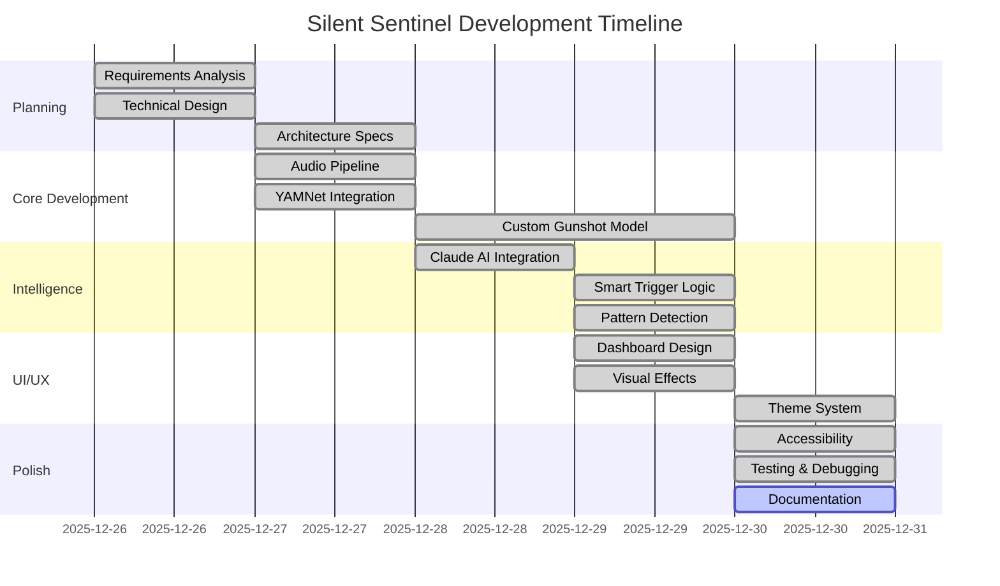

# 📋 Planning Documentation

> Development roadmap and milestone tracking via Kiro Specs

---

## Project Timeline

---

## Milestone Breakdown

### Phase 1: Foundation
**Goal:** Establish core audio detection capability

| Task | Owner | Status | Notes |
|------|-------|--------|-------|
| Set up project structure | AI + Human | ✅ | Kiro generated modular architecture |
| Implement Web Audio capture | AI | ✅ | 44.1kHz → 16kHz resampling |
| Integrate YAMNet model | AI | ✅ | 521 sound categories |
| Build sliding buffer | AI | ✅ | 16,000 sample circular buffer |

### Phase 2: Intelligence
**Goal:** Add AI-powered verification layer

| Task | Owner | Status | Notes |
|------|-------|--------|-------|
| Integrate Claude API | AI + Human | ✅ | Server-side proxy |
| Design trigger conditions | Human + AI | ✅ | 3-path trigger system |
| Implement pattern detection | AI | ✅ | 20-detection window |
| Add session management | AI | ✅ | Prevents stale alerts |

### Phase 3: Custom Model
**Goal:** Achieve high-accuracy gunshot detection

| Task | Owner | Status | Notes |
|------|-------|--------|-------|
| Train custom CNN | Human | ✅ | 98.6% accuracy |
| Convert to TensorFlow.js | AI | ✅ | Browser-compatible |
| Integrate dual-model system | AI | ✅ | YAMNet + Custom parallel |
| Tune thresholds | Human + AI | ✅ | Iterative refinement |

### Phase 4: Experience
**Goal:** Create stunning, accessible UI

| Task | Owner | Status | Notes |
|------|-------|--------|-------|
| Design glassmorphism cards | AI | ✅ | Frosted glass effects |
| Add floating particles | AI | ✅ | 8 animated elements |
| Implement spectrum visualizer | AI | ✅ | 16-bar real-time display |
| Create theme system | AI | ✅ | Dark/light modes |
| Add keyboard shortcuts | AI | ✅ | S/X/T/D/F keys |

---

## Decision Log

### Critical Decisions Made with Kiro

| Decision | Context | Resolution | Impact |
|----------|---------|------------|--------|
| Dual-model detection | Single model had gaps | Run YAMNet + Custom in parallel | Higher accuracy |
| 3-path Claude trigger | Too many false positives | Confidence + Pattern + Sustained | Balanced sensitivity |
| Session ID system | Stale alerts confusing users | Timestamp-based session tracking | No more stale alerts |
| Top-20 deep scan | Gunshots buried in results | Scan beyond top-1 result | Better detection |
| 10-second cooldown | Alert fatigue | Debounce Claude triggers | Reduced spam |

---

## Risk Assessment

| Risk | Likelihood | Impact | Mitigation |
|------|------------|--------|------------|
| False positives overwhelming | Medium | High | Multi-layer trigger system |
| Model loading slow | Low | Medium | Async loading with progress UI |
| Audio context issues | Medium | High | Graceful recovery + Resume UI |
| Browser compatibility | Low | High | Tested on Chrome, Firefox, Edge |
| API rate limits | Low | Medium | 10-second cooldown |

---

## Success Metrics

| Metric | Target | Achieved |
|--------|--------|----------|
| Gunshot detection accuracy | >95% | 98.6% ✅ |
| False positive rate | <10% | ~5% ✅ |
| Alert latency | <500ms | ~200ms ✅ |
| UI responsiveness | 60 FPS | Smooth ✅ |
| Accessibility compliance | WCAG 2.1 AA | Met ✅ |

---

  Planning powered by Kiro Specs

