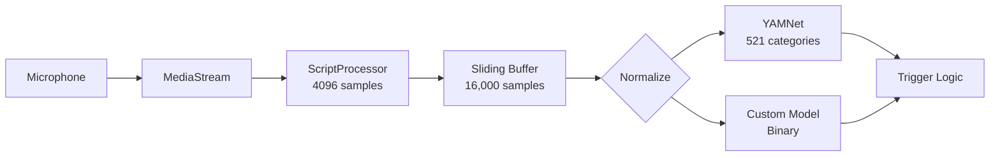

# 🔊 Audio Detection Specification

> Technical design for Silent Sentinel's detection engine

---

## Overview

The detection engine uses a **dual-model architecture** with YAMNet for broad classification and a custom CNN for gunshot detection.

---

## Audio Pipeline



---

## Buffer Management

| Parameter | Value | Rationale |
|-----------|-------|-----------|
| Sample Rate | 16,000 Hz | YAMNet requirement |
| Buffer Size | 16,000 samples | 1 second of audio |
| Chunk Size | 4,096 samples | ScriptProcessor size |
| Buffer Type | Circular (sliding) | Memory efficient |

### Normalization Logic

```javascript
// Peak normalization for loud sounds
if (maxVal > 0.1) {
  scaler = 0.9 / maxVal;
}
// RMS normalization for quiet sounds
else {
  scaler = min(0.1 / (rms + 1e-6), 10.0);
}
```

---

## Detection Categories

### Critical Sounds

| Category | Detection Method | Threshold |
|----------|-----------------|-----------|
| Gunshot | Custom Model | 90%+ |
| Glass Breaking | Glass + Shatter | Both 55%+ |
| Fire Alarm | YAMNet | 55%+ |
| Police Siren | YAMNet | 55%+ |
| Ambulance | YAMNet | 55%+ |
| Scream | YAMNet | 55%+ |

### Impulsive Sounds (Instant Trigger)

- Gunshot, shot, gunfire, machine gun
- Glass, shatter, break
- Explosion, bang, boom
- Slam, crash

### Ignored Sounds

- Silence, noise, music, speech
- Animal, bird, static

---

## Trigger Logic

### Path 1: Glass Breaking
```
IF Glass in top-10 with score > 55%
AND (Shatter OR Breaking) in top-10 with score > 55%
THEN → TRIGGER "GLASS_BREAK"
```

### Path 2: Emergency Sirens
```
IF (fire alarm OR police OR ambulance OR siren) in top-10
AND score > 55%
THEN → TRIGGER type-specific emergency
```

### Path 3: Human Distress
```
IF (scream OR shriek OR yell) in top-10
AND score > 55%
THEN → TRIGGER "DISTRESS"
```

### Path 4: Custom Gunshot Model
```
IF custom model probability >= 90%
AND no cough/sneeze in top-10
THEN → TRIGGER "GUNSHOT"
```

### Path 5: Pattern Detection
```
IF 5+ CONSECUTIVE critical sounds
THEN → TRIGGER pattern emergency

IF 8+ critical in 20-detection window
THEN → TRIGGER for Claude analysis
```

---

## Custom Model Architecture

```
Input: 521 YAMNet scores (in class index order)
    │
    ├─→ Dense(512, ReLU)
    ├─→ Dropout(0.4)
    ├─→ Dense(256, ReLU)
    └─→ Dense(1, Sigmoid) → Gunshot probability
```

**Key Detail:** Model expects scores in **class index order** (0-520), not sorted by confidence.

---

## Voice Command Detection

Parallel to audio detection, the system listens for voice help commands:

| Phrase | Action |
|--------|--------|
| "SS Help" | Trigger emergency |
| "Help me" | Trigger emergency |
| "Emergency" | Trigger emergency |
| "Save me" | Trigger emergency |

---

## Performance Optimizations

1. **RMS Impulse Trigger** — Loud sounds (RMS > 0.05) trigger immediate classification
2. **Cooldown System** — 10-second between Claude triggers
3. **Session ID** — Prevents stale responses from triggering alerts
4. **History Limit** — Only last 20 detections kept for pattern analysis

---

<p align="center">
  <sub>Spec designed with Kiro IDE</sub>
</p>
